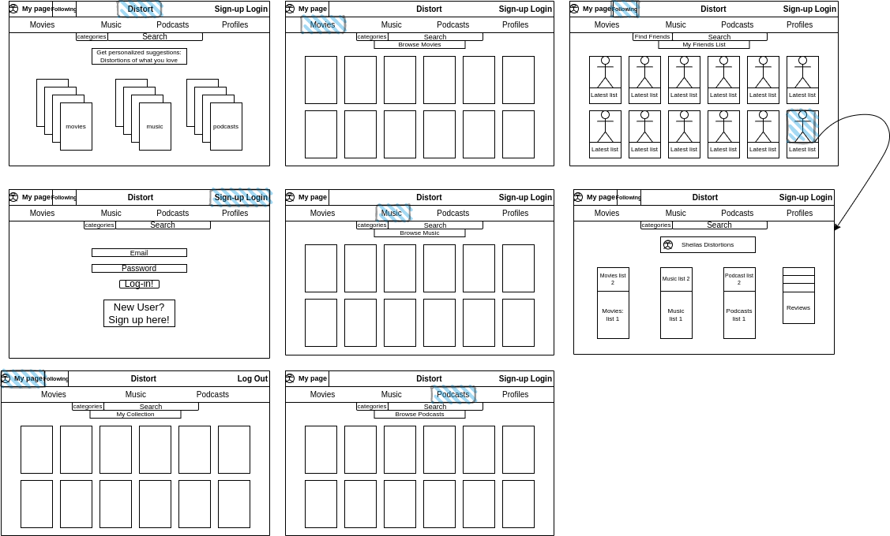
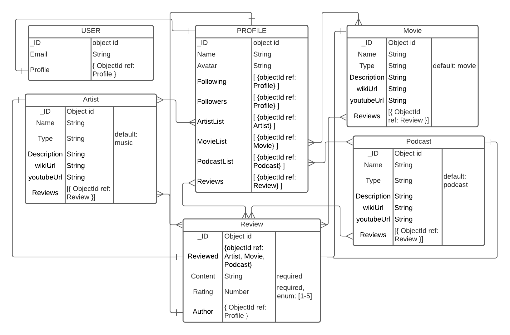

# Distort

## Objective 
+ Build a full stack suggestion application where the user is able to accumulate lists of suggested movies, music, and podcasts.
+ Users will be able to input an initial query of a movie, music artist, or podcast and get a list of suggestions from that same category.
+ Users will be able to add returned suggestions to their respective collection lists.
+ Users will be able to look at other suggestion lists created by other users on the application and follow them. 
+ Users will be able to rate and review suggestions on their lists as well as the lists of others.
+ Users will be able to update their collection lists.

---

## Motivation
Most people usually go off of the suggestions made by others in life. These suggestions are most often given to reflect the existing interests one might have. Suggestions are distortions of that initial interest. This was the basis and idea for the name of the app and we are proud to introduce, Distort. 

---

## Getting Started: 
### Click [here]() to go to the application.
---

## Images

### Wireframe

### ERD

### Final outloook of the application

---

## Technology Implemented:
+ Axios
+ dotenv
+ ejs
+ Express
+ Javascript
+ HTML
+ CSS
+ Git
+ Mongoose
+ MongoDb
+ JWT
+ cors
+ bycrypt
+ TasteDive Api

---

## Stretch goals

+ TBD